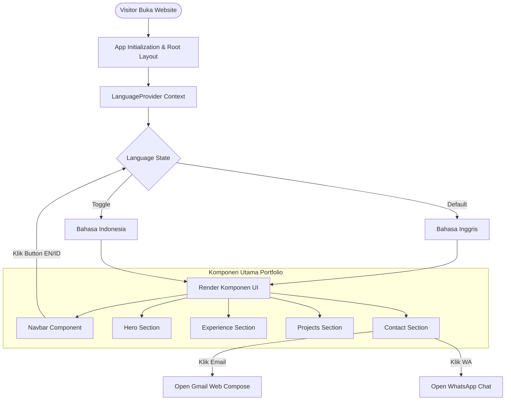

# Fayza Siti Rahmawati - Portfolio Website

A modern, interactive, and responsive multilingual portfolio website built with Next.js, TypeScript, Tailwind CSS, and Framer Motion.

## 🚀 Live Demo

- **Production URL**: [https://fayzarahma-portofolio.vercel.app](https://fayzarahma-portofolio.vercel.app)

## 🛠️ Tech Stack

- **Framework**: [Next.js](https://nextjs.org/) (App Router)
- **Language**: [TypeScript](https://www.typescriptlang.org/)
- **Styling**: [Tailwind CSS](https://tailwindcss.com/)
- **Animations**: [Framer Motion](https://www.framer.com/motion/)
- **Icons**: [React Icons](https://react-icons.github.io/react-icons/)
- **Internationalization (i18n)**: Custom React Context (`LanguageProvider`)

## 📊 Application Architecture & Flow

